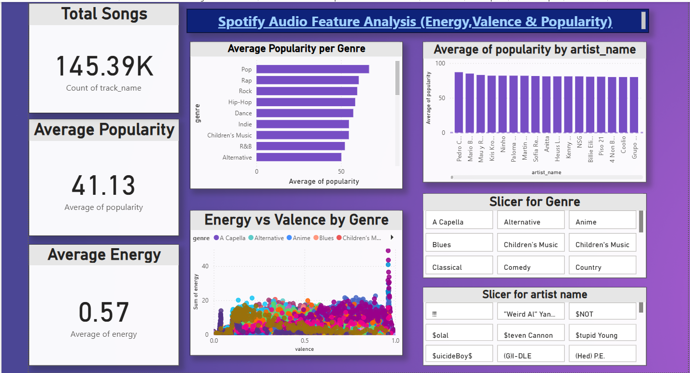

## 🎧 Spotify Audio Feature Analysis  
This project analyzes Spotify tracks using Python and Power BI to explore trends in energy, valence, danceability, and popularity. The analysis identifies top artists, genres, and overall music moods through visual insights. Tools like Pandas, Matplotlib, and Scikit-learn were used for data processing, and an interactive Power BI dashboard presents the results clearly.

